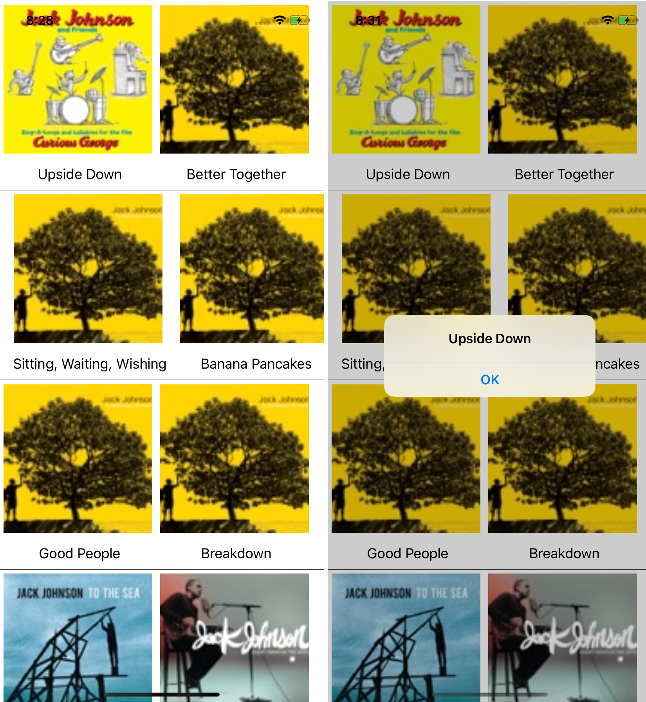
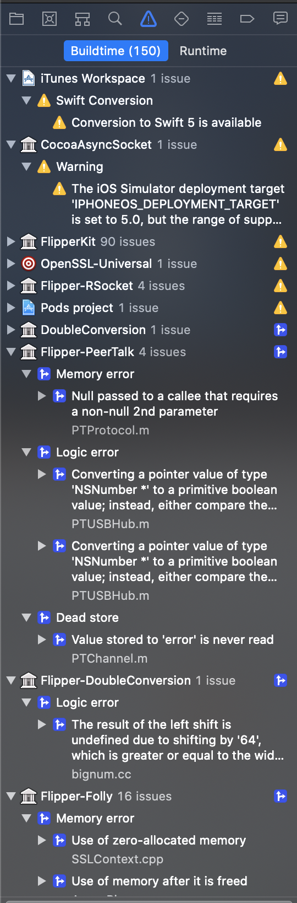

# iTunes Search

Fetch iTunes Search Api to search content.

[![React Native][react-image]][react-url]
[![npm Version][npm-image]][npm-url]
[![Build Status][travis-image]][travis-url]
[![License][license-image]][license-url]
[![Platform][platform-image]][react-url]

## Version

0.63

## Prerequisites

- Xcode 11.3 or later
- iOS 13.2 or later
- macOS 10.15 or later
- Android Studio 4.0 or later
- Visual Studio Code 1.48 or later
- React Native Tools extension of VS Code

## 1. Dependencies

We will be building this app using VS Code with React Native Tools extension. This app will also consume the [iTunes Search API](https://itunes.apple.com/search?entity=song&term=jack+johnson) hosted on [jsonkeeper.com](https://jsonkeeper.com/b/YKTT) to fetch tracks/songs of an artist. 

Install them using Homebrew is recommended.

- Node
- Watchman

## 2. Library Dependencies

- react-native-image-progress (Progress indicator for networked images in React Native [Installation instructions](https://www.npmjs.com/package/react-native-image-progress).)

- react-native-progress (Progress indicators and spinners for React Native using ReactART [Installation instructions](https://www.npmjs.com/package/react-native-progress).)

## 3. Written in React Native

This sample is written in React Native.

## Tools

- [CocoaPods](https://cocoapods.org/) - CocoaPods is a dependency manager for Swift and Objective-C Cocoa projects. It has over 33 thousand libraries and is used in over 2.2 million apps. CocoaPods can help you scale your projects elegantly.
- [Xcode Command Line Tools](https://developer.apple.com/library/archive/technotes/tn2339/_index.html) - The Command Line Tools Package is a small self-contained package available for download separately from Xcode and that allows you to do command line development in macOS.

## Design Patterns

- ### MVC

 Model-View-Controller (MVC) is Apple’s recommended architectural pattern. MVC is a software development pattern made up of three main objects:

- The Model is where your data resides. Things like persistence, model objects, parsers, managers, and networking code live there.
- The View layer is the face of your app. Its classes are often reusable as they don’t contain any domain-specific logic. For example, a UILabel is a view that presents text on the screen.
- The Controller mediates between the view and the model via the delegation pattern. In an ideal scenario, the controller entity won’t know the concrete view it’s dealing with. Instead, it will communicate with an abstraction via a protocol. 

- ### Facade

The Facade design pattern provides a single interface to a complex subsystem. Instead of exposing the user to a set of classes and their APIs, you only expose one simple unified API.

- ### Decorator

The Decorator pattern dynamically adds behaviors and responsibilities to an object without modifying its code. It’s an alternative to subclassing where you modify a class’s behavior by wrapping it with another object.

Install babel plugins to enable decorators. ES6 & ES7 Decorators support is added in React Native.

## Features

- MVC pattern used (recommanded by Apple)
- Modular enough to add headers in request of iTunes Search API.
- Ready for background fetch (using `fetch` with callback).
- Integrated API in `App.js`
- UI Testing using XCUITest
- CI/CD - Sonar Qube

## Installation

\*Clone or download the repository

- Option 1
    - Open working directory in VS Code
    - In the Command Palette, type React Native and choose a command.
    - The Run Android command triggers react-native run-android and starts your app for Android.
    - The Run iOS command similarly triggers react-native run-ios and starts your app in the iOS simulator 
- Option 2
    - Go to {ROOT}/ios directory
    - Open iTunes.xcworkspace
    - Use command + B or Product -> Build to build the project
    - Press run icon in Xcode or command + R to run the project on Simulator
- Option 3
    - Launch Android Studio
    - Click on `Open an existing Android Studio project`
    - Navigate to {ROOT}/android directory
    - Click Open

## Step to run the project from command-line

- Go to working Directory
- npx react-native run-ios
- npx react-native run-android

## Step to static code coverage

- Open iTunes.xcworkspace
- Use Command+Shift+B or Product+Analyze to analyze the project

# Step to execute test cases

- Use Command+U or Product+Test to execute the test case

## To Do

### CI/CD

- [Jenkins](http://jenkins.io)
- [Azure DevOps](https://azure.microsoft.com/en-in/services/devops/#DevOps)
- [TestFlight](https://developer.apple.com/testflight/)
- [fastlane](https://fastlane.tools)
- [Xcode Server](https://developer.apple.com/library/archive/documentation/IDEs/Conceptual/xcode_guide-continuous_integration/index.html)
- [Unit Test](https://developer.apple.com/library/archive/documentation/IDEs/Conceptual/xcode_guide-continuous_integration/index.html)
- [UI Test](https://developer.apple.com/library/archive/documentation/IDEs/Conceptual/xcode_guide-continuous_integration/index.html)

### Crash Reporting

- [AppCenter](https://appcenter.ms/)

## Code Coverage

- [SonarQube 7.2.1](https://github.com/Jintin/Swimat) - SonarQube provides the capability to not only show health of an application but also to highlight issues newly introduced. With a Quality Gate in place, you can fix the leak and therefore improve code quality systematically.

## License

Distributed under the MIT license. See `LICENSE` for more information.

[LICENSE](LICENSE)

[npm-image]: https://img.shields.io/npm/v/react-native-image-progress.svg
[react-image]: https://img.shields.io/badge/react%20native-0.63-blue
[react-url]: https://reactnative.dev/versions
[npm-url]: https://www.npmjs.com/
[license-image]: https://img.shields.io/badge/License-MIT-blue.svg
[license-url]: LICENSE
[travis-image]: https://img.shields.io/travis/dbader/node-datadog-metrics/master.svg?style=flat-square
[travis-url]: https://travis-ci.org/dbader/node-datadog-metrics
[platform-image]: https://img.shields.io/badge/platform%20-iOS%20Android-blue

